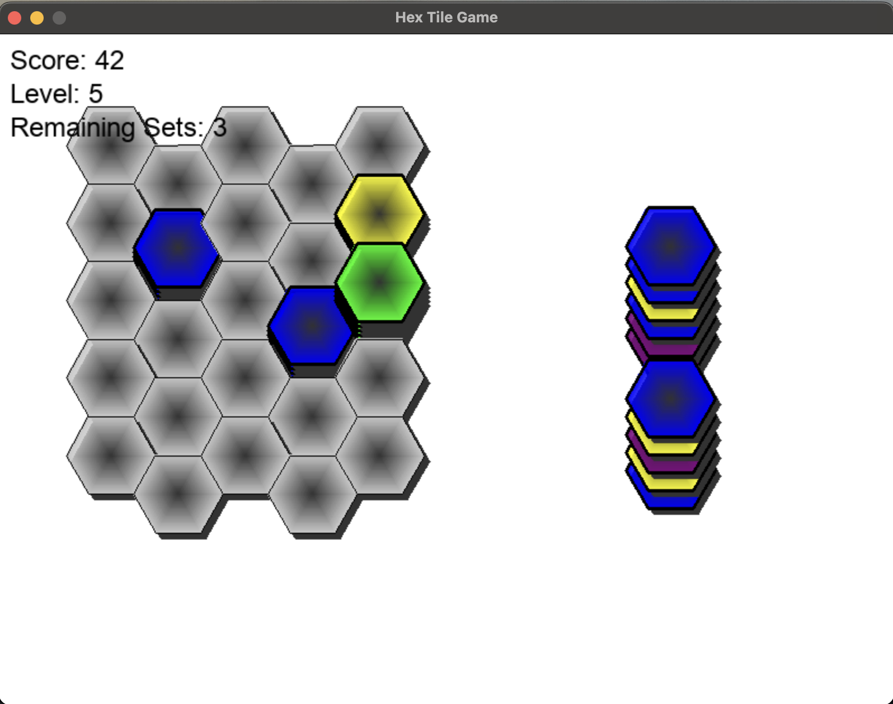
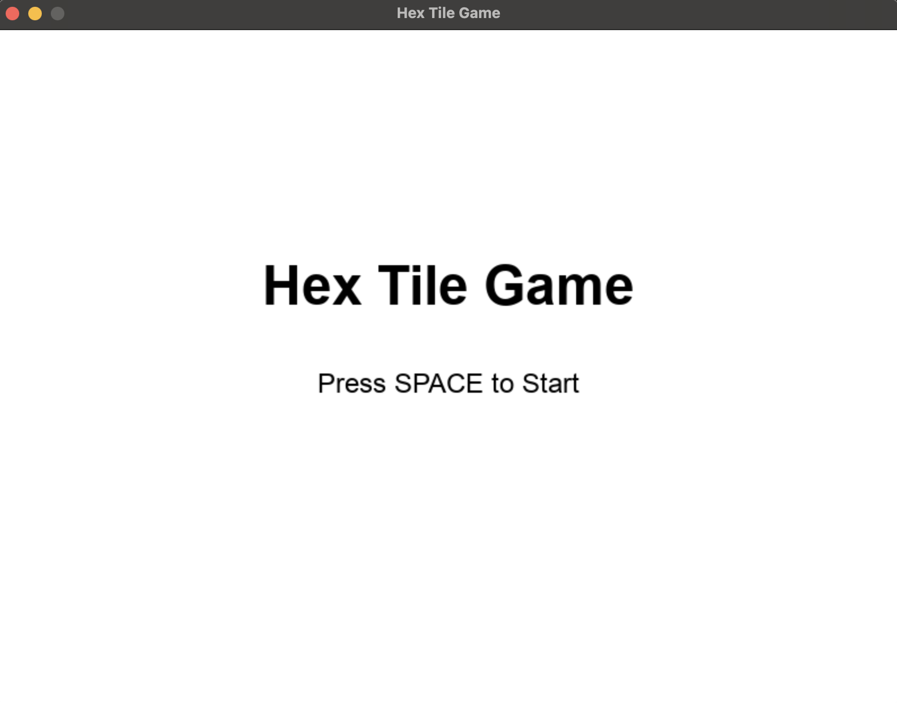
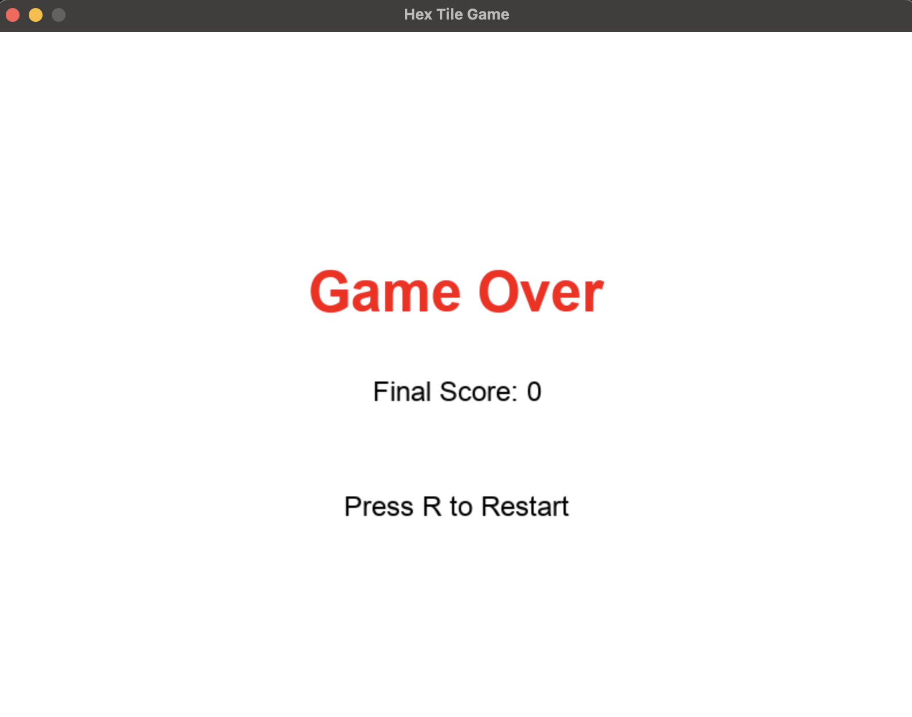

# 🌟 **Hexa-Tile Adventure** 🌟  

<div align="center">
  
  
  <p><i>육각형 퍼즐과 창의성의 만남! (왼: pygame-hex_tile_game), (오: pencil sort)</i></p>
</div>

---

## 🎮 **게임 개발 계기**

### **왜 Hexa-Tile Adventure를 만들었나요?**

**Hexa-Tile Adventure**는 퍼즐 게임의 매력을 최대한 활용하며, **광고 없는 몰입 경험**을 제공하기 위해 제작되었습니다.  
평소 [Pencil Sort](https://apps.apple.com)라는 게임을 즐기며 광고와 제한적인 플레이에 불편함을 느껴 직접 제작하기로 결심했습니다.
터틀 게임을 진행하면서 pygame으로 이 게임을 구현해보면 어떨까라는 호기심으로 시작했습니다.

### **💡 개발 목표**
1. **완벽한 플레이 자유도 제공**: 광고 없이 순수 게임에 집중.
2. **퍼즐 메커니즘의 창의적 확장**: 육각형 타일과 연결 시스템을 더 복잡하고 도전적으로 설계.
3. **Python 및 Pygame 학습**: 단순한 게임 제작을 넘어 코딩 실력을 한 단계 향상.

---

## 🎮 **게임 소개**

**Hexa-Tile Adventure**는 전략적 사고와 창의력을 요구하는 3D 퍼즐 게임입니다.  
게임은 육각형 타일을 보드에 배치하고, **같은 색상** 타일을 연결하여 문제를 해결하는 것이 핵심입니다.

### **게임의 목표**  
- **타일 배치:** 플레이어는 보드 위에 타일을 자유롭게 배치합니다.  
- **타일 연결:** 같은 색 타일을 연결하여 점수를 획득합니다.  
- **레벨 클리어:** 도전 과제를 해결하고 다음 레벨로 넘어갑니다.  

### **특징**
1. **독창적인 육각형 타일 시스템**  
   기존의 직사각형 퍼즐이 아닌, 육각형 타일을 사용하여 새로운 도전과 재미를 제공합니다.
2. **연속적인 점수 획득 시스템**  
   연결된 타일 수가 많을수록 보너스 점수가 더해집니다.
3. **시각적 효과**  
   연결된 타일이 사라질 때 화려한 애니메이션이 플레이됩니다.

---

## 🌈 **게임의 주요 특징**

<div align="center">
  <table style="border-collapse: collapse; width: 90%; text-align: center; font-size: 16px;">
    <thead>
      <tr style="border-bottom: 2px solid #4caf50;">
        <th style="padding: 10px;">🎮 기능</th>
        <th style="padding: 10px;">✨ 상세 설명</th>
      </tr>
    </thead>
    <tbody>
# Hex Tile Game 메커니즘 분석

## 1️⃣ 보드와 타일의 구조

### 보드 (board)
- **구조**:  
  - 3차원 배열로 구성되며, `board[row][col]`은 특정 위치의 **타일 스택**을 나타냅니다.
  - 각 칸에는 여러 개의 타일을 쌓을 수 있습니다.
- **크기**:  
  - `5x5`의 고정된 크기를 가지며, 타일은 육각형 모양으로 배치됩니다.

### 타일 (Tile 클래스)
- **속성**:  
  - `color`: 타일의 색상을 나타냅니다.
- **역할**:  
  - Tile 객체는 보드나 타일 세트에 저장되어 게임 진행 중 관리됩니다.

---

## 2️⃣ 육각형 타일 렌더링

### 타일 렌더링
- 육각형을 그리기 위해 **360도를 6등분**하여 점 좌표를 계산합니다.
- 타일에는 그림자와 그라데이션 효과를 추가하여 **시각적 품질**을 높였습니다.

### 보드 렌더링
- 보드를 순회하며 각 칸에 육각형 타일을 렌더링합니다.
- 타일이 쌓여 있는 경우, 쌓인 타일마다 높이에 따라 위로 이동하여 표시됩니다.

---

## 3️⃣ 게임의 주요 로직

### 3.1 랜덤 타일 생성
- **함수**: `generate_tile_set(level)`
- **설명**:  
  난이도(`level`)에 따라 타일 세트를 생성하며, 레벨이 높아질수록 타일 수와 사용 가능한 색상의 종류가 증가합니다.
- **타일 속성**:  
  Tile 객체로 생성되며, 색상은 `COLORS` 리스트에서 무작위로 선택됩니다.

### 3.2 타일 연결 및 제거
- **이웃 탐색 (`get_neighbors`)**:
  - 홀수 열 및 짝수 열을 고려하여 육각형 타일의 6방향(상, 하, 좌, 우, 좌상, 우하)을 계산하여 이웃 좌표를 반환합니다.
- **연결된 타일 찾기 (`find_connected_tiles`)**:
  - 특정 좌표에서 **재귀적으로** 같은 색상의 연결된 타일을 탐색합니다.
- **타일 제거 (`remove_tiles`)**:
  - 특정 위치의 타일을 제거하며, 타일 제거 시 점수가 추가됩니다.
- **타일 제거 확인 (`check_for_removal`)**:
  - 보드 전체를 순회하며, 스택이 6개 이상 쌓인 위치의 타일을 제거합니다.
  - 타일이 제거될 때 점수가 증가하며, 점수에 따라 레벨이 상승합니다.

### 3.3 타일 이동
- **함수**: `move_tile(board, row, col)`
- **설명**:  
  특정 위치의 타일을 이동시키며, 동일한 색상의 이웃 타일로 이동합니다.
- **동작**:  
  이동 가능한 이웃이 없으면 타일은 원래 위치로 돌아갑니다.

---

## 4️⃣ 게임 상태 관리

### 게임 상태 변수
- `score`: 현재 점수.
- `level`: 현재 레벨.
- `max_level`: 최대 레벨.
- `is_game_over`: 게임 종료 여부.

### 게임 시작
- **함수**: `start_game()`
- **설명**:  
  보드와 타일 세트를 초기화하고, 점수와 레벨을 리셋합니다.

### 게임 종료
- **함수**: `check_game_over(board)`
- **설명**:  
  보드의 모든 칸이 가득 차면 게임이 종료됩니다.
- **UI**:  
  게임 종료 시, "Game Over" 메시지와 점수가 화면에 표시됩니다.

---

## 5️⃣ UI와 인터페이스

### 점수 및 시간 표시
- 점수, 레벨, 남은 타일 세트 수를 화면 상단에 표시합니다.
- 제한 시간이 표시되며, 시간이 0초가 되면 게임이 종료됩니다.

### 시작 및 종료 화면
- **시작 화면**:  
  "Press SPACE to Start" 메시지를 표시합니다.
- **종료 화면**:  
  최종 점수와 "Press R to Restart" 메시지를 표시합니다.

---

## 6️⃣ 메인 루프

### 상태 흐름
- **시작 화면**:  
  스페이스바를 누르면 게임이 시작됩니다.
- **플레이 상태**:  
  타일을 드래그하여 보드에 배치하고, 타일을 제거하며 점수를 획득합니다.
- **종료 화면**:  
  보드가 가득 차거나 제한 시간이 종료되면 게임이 종료됩니다.

### 이벤트 처리
- **드래그 앤 드롭**:
  - 마우스 클릭으로 타일을 선택하고, 드래그하여 보드에 배치합니다.
- **키 입력**:
  - `R`: 게임 재시작.
  - `SPACE`: 게임 시작.

---

## 7️⃣ 추가한 요소

### 제한시간 추가
- 제한 시간이 게임에 추가되어 남은 시간을 관리하며, 시간이 다 되면 게임이 종료됩니다.

### 멀티 레벨 지원
- 레벨이 증가할수록 난이도가 점진적으로 상승합니다.

### 타일의 시각적 효과
- 타일에 그라데이션과 그림자를 추가하여 시각적 품질을 향상했습니다.
    </tbody>
  </table>
</div>

---

## 🛠️ **게임 가이드**

### **1️⃣ 시작하기**

#### **목표**  
- 육각형 타일을 보드에 배치하고, **같은 색 타일**을 연결하여 점수를 획득하세요.
- 6개 이상의 같은 색 타일이 연결되면 사라지며 **점수가 추가**됩니다.

#### **레벨 업 규칙**
- 모든 타일을 정리한 후, 더 높은 난이도에서 새로운 도전에 도전하세요.
- 각 레벨마다 색상 패턴과 배치가 복잡해집니다.

---

### **2️⃣ 조작법**
#### 🚀 기본 조작
- **드래그 앤 드롭:** 마우스로 타일을 클릭하여 원하는 위치로 이동합니다.

#### 🌀 고급 기능
- **자동 정렬:** 타일을 보드에 맞추어 자동으로 배치됩니다.
- **타일 제거:** 불필요한 타일을 선택하여 제거하고 새로운 타일을 요청할 수 있습니다.

---

## 📦 **설치 및 실행 방법**

1. **레포지토리 클론**
   ```bash
   git clone https://github.com/jeongminuk/OpenSourceSoftware.git

## 🎉 개발 과정 및 앞으로의 계획

### **개발 중 느낀 점**
- **Pygame의 타일 연결 시스템**을 구현하는 과정은 도전적이었지만, 이를 통해 Python 자료 구조를 활용하는 능력을 크게 향상할 수 있었습니다.
- 특히 **육각형 타일의 배치를 위한 알고리즘 설계**는 기존 퍼즐 게임과 차별화된 흥미로운 작업이었습니다.

### **향후 추가 기능**
1. **멀티플레이어 모드**  
   - 다른 플레이어와 점수를 경쟁할 수 있는 **실시간 모드**를 추가할 예정입니다.
2. **커스터마이징**  
   - 사용자가 **타일 색상**과 **배경 테마**를 자유롭게 변경할 수 있는 옵션을 제공할 계획입니다.


###game over**

